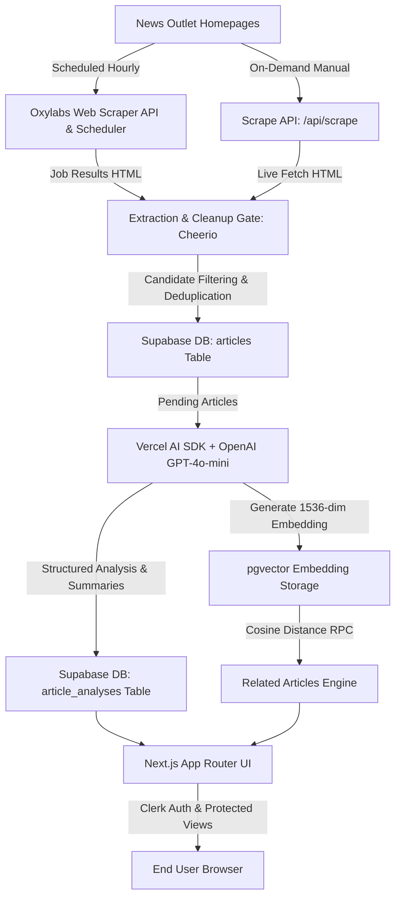

# Biasly — AI-Powered News Analysis & Political Framing Platform

Biasly is a production-grade AI-powered news intelligence platform designed to scrape, parse, analyze, and visualize real-time sentiment and political framing in news coverage. By collecting raw news articles from active major news outlets (such as Reuters, BBC, NPR, Fox News, Guardian, etc.) via Oxylabs, processing them through strict content validation gates, and running AI sentiment and structured political framing estimation via Vercel AI SDK and OpenAI models, Biasly empowers readers to quickly digest neutral news summaries, identify loaded language, evaluate political spectrum distribution (Left / Center / Right percentages), and explore semantically related articles using Supabase `pgvector` vector similarity search.

---

## 🚀 Core Capabilities & Features

- **Automated & Manual Web Scraping**: Live anti-bot bypass scraping via Oxylabs Web Scraper API and Cheerio for extracting clean article text, metadata, images, and publish dates from active news homepages.
- **Oxylabs Scheduler & Vercel Cron Integration**: Automated hourly background scraping jobs synchronized with Vercel Cron (`vercel.json`) running at `:15` past every hour to seamlessly fetch scheduled results and trigger AI analysis.
- **Structured AI Sentiment & Bias Framing**: Leveraging Vercel AI SDK (`ai`, `@ai-sdk/openai`) to generate neutral summaries, sentiment scores (-1.0 to +1.0), AI-estimated political framing scores (Left, Center, Right percentages strictly summing to 100%), confidence scores, framing notes, loaded terms, and analytical disclaimers.
- **Semantic Vector Search (`pgvector`)**: 1536-dimensional OpenAI vector embeddings (`text-embedding-3-small`) stored in Supabase with `ivfflat` indexing and custom `match_related_articles` PostgreSQL RPC functions to surface semantically relevant related coverage on article detail pages.
- **User Authentication**: Secure user authentication and sign-in / sign-up flows managed by Clerk Auth (`@clerk/nextjs`).
- **Modern Responsive UI**: Built with Next.js 16 App Router, React 19, TypeScript, and Tailwind CSS v4, featuring dynamic color-coded Bias Meters, sentiment badges, source filtering, and detailed article view modals/pages.
- **Robust Pipeline Logging & Admin Security**: Comprehensive event logging stored in Supabase `logs` table and secured API mutation routes protected via `x-biasly-admin-secret` headers and `CRON_SECRET` parameters.

---

## 🛠️ Technology Stack

| Layer | Technologies Used |
| :--- | :--- |
| **Frontend Framework** | Next.js 16 (App Router), React 19, TypeScript 5 |
| **Styling & Icons** | Tailwind CSS v4, Lucide React icons, Custom CSS Design System |
| **Authentication** | Clerk Auth (`@clerk/nextjs`) |
| **Database & Vector Search** | Supabase PostgreSQL, `pgvector` extension (`vector(1536)`), Row Level Security (RLS) |
| **Scraping & Parsing** | Oxylabs Web Scraper API, Oxylabs Scheduler, Cheerio HTML parser |
| **AI & NLP Engine** | Vercel AI SDK (`ai`, `@ai-sdk/openai`), OpenAI (`gpt-4o-mini`, `text-embedding-3-small`), Zod validation |
| **Orchestration & Analytics**| Vercel Cron (`vercel.json`), PostHog analytics |

---

## 📐 System Architecture

### High-Level Data Flow



### Architectural Layer Breakdown

1. **Presentation Layer (`app/`, `components/`)**:
   - **Home Page (`app/page.tsx`)**: Responsive grid view displaying news cards, source filtering, sentiment tags, political spectrum meters, and search filters.
   - **Article Details Page (`app/article/[id]/page.tsx`)**: Deep dive into full article text, neutral summary, Left/Center/Right framing breakdown, loaded terms, confidence ratings, and `pgvector` related articles carousel.
   - **Auth Pages (`app/sign-in`, `app/sign-up`)**: Clerk auth components for user management.
2. **API & Controller Layer (`app/api/`)**:
   - Thin route handlers executing pipeline orchestration for manual scraping, scheduler synchronization, AI analysis execution, and Vercel Cron invocations.
3. **Pipeline & Parsing Engine (`lib/scraping/`, `lib/ai/`)**:
   - `lib/scraping/oxylabs.ts`: Oxylabs scraper client with raw 64-bit integer string extraction (protecting against JavaScript `Number.MAX_SAFE_INTEGER` precision loss).
   - `lib/scraping/extractor.ts`: Cheerio link extraction, candidate URL filtering, non-article link reject list enforcement, and raw text DOM cleanup.
   - `lib/scraping/pipeline.ts`: Chunked deduplication checking (<=15 URLs per Supabase query), detail page scraping, content gate validation, and article insertion.
   - `lib/ai/analyzer.ts`: Batch AI analysis, structured Zod output validation, political framing constraint checking, vector embedding generation, and `article_analyses` upserting.
4. **Database & Storage Layer (`supabase/`)**:
   - Supabase PostgreSQL database handling active sources, articles, structured AI analyses, system logs, vector embeddings, and scheduler state tracking.

---

## 🗄️ Database Schema & Vector Search

The application relies on Supabase PostgreSQL with 6 primary tables and `pgvector` extension enablement (`supabase/schema.sql`):

- **`sources`**: Active news sources, homepage listing URLs, logo images, parser strategies, and active status flags.
- **`articles`**: Scraped news articles, unique original/canonical URLs, titles, image URLs, published timestamps, raw text, and analysis completion timestamps.
- **`article_analyses`**: Structured AI output including neutral summary, sentiment score (-1 to 1), sentiment label (`positive`/`neutral`/`negative`), political framing percentages (`left_percentage`, `center_percentage`, `right_percentage`), derived `bias_score` (`(right - left) / 100`), `bias_label`, framing notes, loaded terms array, model metadata, and `embedding vector(1536)`.
- **`logs`**: System event logging (`info`, `warn`, `error`) with JSON metadata for auditing pipeline runs.
- **`oxylabs_schedules`**: Synchronized Oxylabs Scheduler job IDs mapping to active source IDs.
- **`oxylabs_schedule_runs`**: Historical run records tracking Oxylabs background job completions.

### pgvector Similarity Search RPC Function

```sql
CREATE OR REPLACE FUNCTION match_related_articles(
  target_article_id UUID,
  target_embedding vector(1536),
  match_count INT DEFAULT 5
)
RETURNS TABLE (article_id UUID, similarity FLOAT)
LANGUAGE plpgsql AS $$
BEGIN
  RETURN QUERY
  SELECT aa.article_id, (1 - (aa.embedding <=> target_embedding))::FLOAT AS similarity
  FROM article_analyses aa
  JOIN articles a ON a.id = aa.article_id
  WHERE aa.embedding IS NOT NULL
    AND a.analyzed_at IS NOT NULL
    AND aa.article_id != target_article_id
  ORDER BY aa.embedding <=> target_embedding
  LIMIT match_count;
END;
$$;
```

---

## 🔑 Environment Variables & Setup

Create a `.env.local` file in the project root with the following configuration keys:

```env
# Clerk Authentication
NEXT_PUBLIC_CLERK_PUBLISHABLE_KEY=pk_test_...
CLERK_SECRET_KEY=sk_test_...

# Supabase Storage & Database
NEXT_PUBLIC_SUPABASE_URL=https://your-supabase-project.supabase.co
NEXT_PUBLIC_SUPABASE_ANON_KEY=eyJhbG...
SUPABASE_SERVICE_ROLE_KEY=eyJhbG...

# Oxylabs Web Scraper & Scheduler
OXYLABS_USERNAME=your_oxylabs_username
OXYLABS_PASSWORD=your_oxylabs_password

# AI SDK & OpenAI Model Provider
OPENAI_API_KEY=sk-proj-...

# Admin Security & Automation Secrets
BIASLY_ADMIN_SECRET=your_secure_admin_secret_here
CRON_SECRET=your_vercel_cron_secret_here
```

### Local Installation & Running Development Server

```bash
# 1. Install dependencies
npm install

# 2. Setup Supabase Database Schema
# Execute supabase/schema.sql in your Supabase SQL Editor, then execute supabase/seed.sql to seed initial active sources.

# 3. Start the Next.js development server
npm run dev

# Open http://localhost:3000 in your browser.
```

---

## ⚡ API Operations Reference

All mutation API routes require administrative authentication via the `x-biasly-admin-secret` request header matching your `BIASLY_ADMIN_SECRET` environment variable.

| Endpoint | Method | Auth / Header | Description |
| :--- | :--- | :--- | :--- |
| `/api/scrape` | `POST` | `x-biasly-admin-secret` | Initiates manual web scraping for active sources and inserts valid new articles. |
| `/api/analyze` | `POST` | `x-biasly-admin-secret` | Runs Vercel AI SDK analysis and generates `pgvector` embeddings for pending articles. |
| `/api/oxylabs/schedules` | `POST` | `x-biasly-admin-secret` | Synchronizes Oxylabs Scheduler jobs for active sources and deactivates orphaned jobs. |
| `/api/oxylabs/scheduled-results/process` | `POST` | `x-biasly-admin-secret` | Fetches completed Oxylabs hourly job HTML and processes them through the scrape pipeline. |
| `/api/cron/pipeline` | `GET` | `CRON_SECRET` Bearer | Vercel Cron trigger running automated hourly ingestion + AI analysis in sequence. |
| `/api/sources` | `GET` | Public / Anon | Fetches list of active news sources stored in Supabase. |
| `/api/logs` | `GET` | Public / Anon | Fetches pipeline execution audit logs. |

---

## 🔮 Potential Future Additions & Roadmap ("What You Can Add Next")

If you are looking to expand **Biasly** into an even more comprehensive news intelligence ecosystem, here are top recommended feature additions:

1. **Multi-Model / Cross-Provider Framing Comparison**:
   - Run parallel AI analyses across multiple AI models (e.g., OpenAI `gpt-4o`, Anthropic `claude-3-5-sonnet`, and Google `gemini-1.5-pro`) to highlight model variance and cross-check AI provider consensus.
2. **Historical Source Framing & Bias Trends**:
   - Aggregate sentiment and political bias percentages over time per news publisher. Build visual interactive timeline charts showing how an outlet's framing shifts across different election cycles or political events.
3. **Personalized User Dashboards & Saved Bookmarks**:
   - Leverage Clerk authentication to enable users to bookmark articles, subscribe to specific news topics (e.g. Economy, Tech, International), and configure custom bias preference alerts.
4. **Real-time Slack / Discord / Email Alerts for High-Bias News**:
   - Set up automated webhook triggers that alert subscribers whenever an article with extreme political bias (e.g., >85% Left or >85% Right) or high loaded term counts is published on breaking news events.
5. **Multimodal Podcast & YouTube News Transcript Scraping**:
   - Expand the Oxylabs scraping pipeline to extract YouTube news broadcast transcripts and audio podcasts, leveraging OpenAI Whisper to transcribe audio and analyze video news framing alongside text articles.
6. **Third-Party Fact-Checking Cross-Referencing**:
   - Integrate external fact-checking APIs (such as PolitiFact, FactCheck.org, or Media Bias/Fact Check) to present independent publisher credibility ratings alongside AI-estimated political framing metrics.
